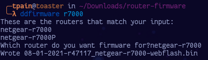

# ddfirmware

## What is ddfirmware?

ddfirmware is a simple script for terminal use.  It queries dd-wrt.com for router firmware based on user input and writes it to the present working directory. 

## System Requirements

* python3
* python requests package (```pip install requests```)




## Installation

```pip install ddfirmware```

## Usage

To use ddfirmware:

### Basic / Current Day

```ddfirmware [router]```

Example: ddfirmware r7000; uses fuzzy regex match

Upon completion of user inputs; downloads the most recent firmware and names it by date of download and firmware revision, placing it in current working directory.


### Arguments

```-f or --five```

prints the last five firmware release dates and allows you to pick from within
